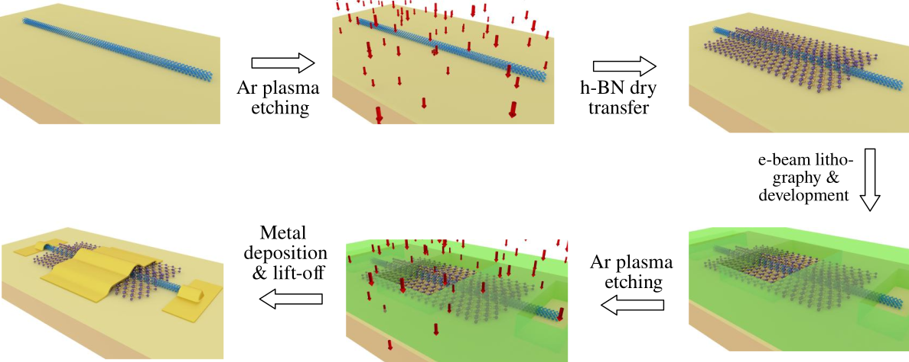
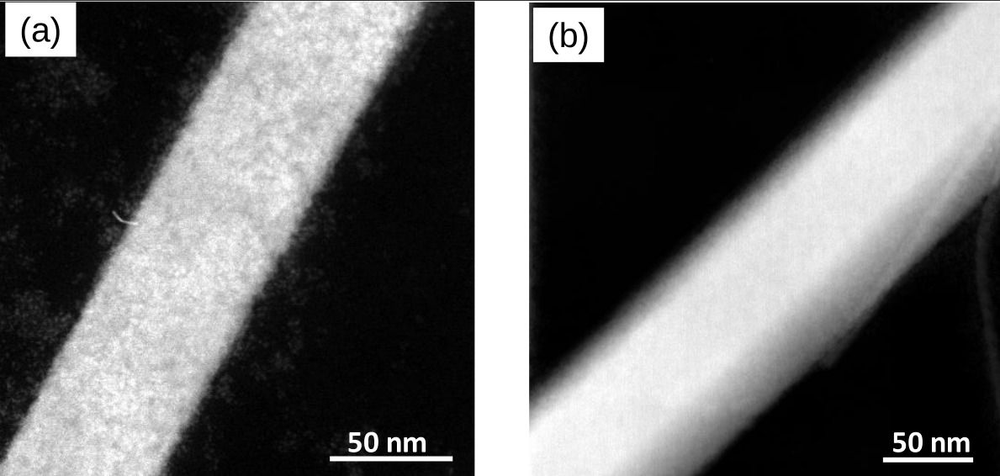
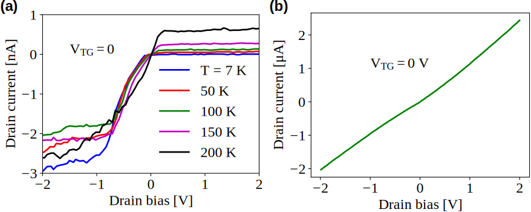

Device Fabrication
====================

The step-by-step fabrication process of the junctionless FET is illustrated in :ref:`Figure 2.3 <ch01-plasma-clean-01>`. 
We drop cast the Te nanowires onto a degenerately doped Si substrate coated with 285 nm thick, thermally grown, high quality SiO₂. 
A low-power Ar treatment is then performed to remove any residual PVP coating from the nanowires. 
A thin layer of high-quality hBN (∼ 15 nm) is immediately transferred onto the nanowire using a dry transfer technique :cite:p:`Castellanos_Gomez_2014` to define the top gate dielectric. 
The atomically smooth surface of the dangling-bond-free hBN gate dielectric provides an ideal interface with the dangling-bond-free Te nanowire channel.

.. _ch01-plasma-clean-01:

  **Figure 2.3:** Step-by-step process flow of Te nanowire junctionless FET fabrication.

Subsequently, electron beam lithography is performed to define the source, the drain, and the gate metallization areas. 
To remove any unintentional residue and surface oxidation :cite:p`lan2007dispersibility` from the source/drain region of the
nanowire, a second plasma cleaning step is performed, which improves the contact interface quality. 
Ni/Au is then deposited using DC magnetron sputtering, followed by lift-off in acetone to complete the device fabrication. 
More details of the fabrication are provided in Appendix \ref{a01_00}.

We find that an optimum plasma cleaning is a crucial step in the fabrication, which helps remove residual PVP capping layer and possible interfacial oxide, improving the interface quality and reducing the contact resistance. A careful optimization shows that Ar plasma cleaning for 20 s at a power level of 10 W (electrode area of 10 cm diameter)  and a pressure of 10 mbar results in the optimum device performance. The :ref:`Figures 2.4 <ch01-plasma-clean-02>`\(a)-(b)
show the STEM images of two different nanowires, one without the plasma cleaning
and the other after plasma cleaning for 20 s, respectively. The plasma-cleaned nanowire clearly shows superior surface quality. 

.. _ch01-plasma-clean-02:

  **Figure 2.4:** HAADF-STEM image of Te nanowire (a) without plasma cleaning, and (b) with plasma cleaning for a duration of 20 s.

The electrical characteristics of a nanowire without plasma cleaning are shown in :ref:`Figures 2.5 <ch01-plasma-clean-03>`\(a) at various temperatures from 7 to 200 K. The characteristics show very low current levels and fast current saturation.
Such an observation has also been made previously for devices using two-dimensional layer materials
:cite:p:`ho2017high`. On the other hand, the nanowires with plasma cleaning show a 1000-fold enhancement in the current drive at similar external bias, indicating superior contact quality as shown in :ref:`Figures 2.5 <ch01-plasma-clean-03>`\(b)

.. _ch01-plasma-clean-03:

 **Figure 2.5:** (a) Temperature-dependent current-voltage characteristics of a nanowire device without plasma cleaning with low current levels and abrupt current saturation. (b) Characteristics of the device at room temperature  with plasma cleaning showing higher current levels and ohmic behaviour.
