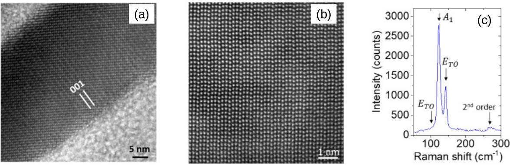

Synthesis and characterization of Te nanowires
================================================

The Te nanowires are synthesized :cite:p:`roy2017manipulation` using Na₂O₃
as a precursor in the water medium, where hydrazine hydrate is used as a reducing
agent, Polyvinylpyrrolidone( PVP) as a capping agent, and Ammonia is used to maintain proper
pH. In a typical experiment, 1 g of PVP (average. M.W.= 58,000)
is dissolved in 20 ml of DI water and 92 mg Na₂O₃
is dissolved in 15 ml DI water separately. Both solutions are mixed
at room temperature. Into the above solution, 1.5 ml of Hydrazine hydrate
and 3.3 ml of 25\% aqueous ammonia solution are added drop-wise with
moderate stirring. The transparent solution is then transferred
to a 50 ml capacity teflon container. Then the hydrothermal reaction
is allowed to take place for 4 hours at 180 °C. After the
reaction vessel cools down to room temperature, the solution is cleaned
twelve times using hot water (60 °C) at 8000 revolutions per minute
and subsequently two times using ethanol.

.. _ch01-material-char-01:

   **Figure 2.1:** (a) X-ray diffraction pattern of Te nanowires, which correspond to P3₁21 rhombohedral phase of Te. Inset: Crystal structure of hexagonal Te chains along the c-axis. Solid lines indicate covalent bonding, while each chain is bonded to other by van der Waals bonds. (b) TEM image of the nanowires. (c) SAED from Te nanowire (bright-field image shown in the inset) showing single-crystalline nature (corresponding to [:math:`1\bar{1}0`] zone axis)

**Structural and microstructural characterization of Te nanowire:** Synthesized Te nanowires have been characterized by X-ray diffraction (XRD) using a Rigaku X-ray Diffractometer with Cu Kα source. :ref:`Figure 2.1 <ch01-material-char-01>`\(a) represents the XRD pattern of the nanowire which corresponds to the rhombohedral phase P3₁21 of Te (JCPDS : 361452) with lattice parameters
of a = b = 4.45 Å, c = 5.9 Å.

Transmission electron micrograph (TEM) in :ref:`Figure 2.1 <ch01-material-char-01>`\(b) shows the one-dimensional morphology
as well as the diameter distribution of the nanowires. The nanowires have an average diameter of 50 nm and a length
of tens of micrometres. The selected area electron diffraction (SAED) pattern
captured from one such nanowire is shown in :ref:`Figure 2.1 <ch01-material-char-01>`\(c)
which suggests the single-crystalline nature of the nanowire. The diffraction
spots correspond to [:math:`1\bar{1}0`] zone axis pattern and can be matched
to (002) and (110) reflections of Te. The lattice fringes in the high-resolution TEM image in :ref:`Figure 2.2 <ch01-material-char-02>`\(a) confirm the growth direction
to be [001]. The high-angle annular dark field (HAADF) STEM image of the nanowire is shown in :ref:`Figure 2.2 <ch01-material-char-02>`\(b), where the atomic layers of Te are clearly visible.

.. _ch01-material-char-02:

  **Figure 2.2:** (a) HRTEM image of the Te nanowire where the lattice fringes correspond to (001) plane of Te. (b) High-resolution HAADF-STEM image of Te nanowires showing the atomic layers. (c) Raman spectroscopy of Te nanowire showing first order and second order peaks.

The nanowires exhibit a strong Raman peak [:ref:`Figure 2.2 <ch01-material-char-02>`\(c)] at 122.8 cm⁻¹  corresponding to the A₁  mode of lattice vibration at the Brillouin zone center :cite:p:`pine1971raman,du2017one`. The :math:`E_{TO}` zone centre modes of vibration manifest as another strong Raman peak at 142.6 cm⁻¹ and a weak shoulder around 103 cm⁻¹ :cite:p:`pine1971raman,liu2010rapid`. We assign the broad peak around 265 cm⁻¹ to second order Raman peak corresponding to :math:`A_1+E_{TO}` two-phonon process :cite:p:`song2008superlong`.
